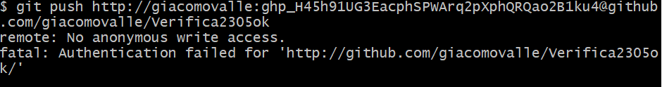
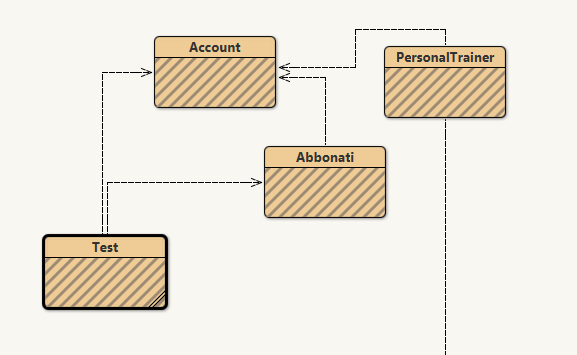

# Verifica2305ok

# TRACCIA
per ogni quesito inserisci la struttura dati corretta e vice versa
(esempio nella prima riga)

Gestione degli ordini in una pizzeria che fa sia da asporto sia servizio al tavolo	Coda
gestione inviti a una festa	
gestione prodotti al interno di un magazzino Amazon	
	tabella hash
	albero binario

in quale situazione è meglio utilizzare una hashmap e in quale una lista? oltre agli esempi motiva la risposta fornendo i pro e i contro di queste 2 strutture dati.

esercizio:
utilizza la struttura dati corretta per il seguente problema
per entrare in palestra ogni abbonato possiede un account con i seguenti attributi (nome,cognome,numero di telefono, tipologia di abbonamento [mensile,annuale]), il software della palestra permette ai dipendenti di inserire nel database tutti i nuovi abbonati e di rimuovere gli abbonati che decidono di disdire l’abbonamento. ogni personal trainer della palestra ha un account (nome,cognome,numero di appuntamenti che può prendere ogni giornata). creare una classe in java che permetta ai dipendenti di registrare,rimuovere ed effettuare una ricerca veloce di tutti gli abbonati, e creare una classe java che permetta ai personal trainer di visualizzare tutti gli incontri di coaching che devono fare nella giornata.

# DESCRIZIONE COMANDI 
ho avuto problemi irrisolvibili nalla aggiunta del file README.md quindi l'ho creato automaticamente 
poi nell'aggiunta dei file java ho provato in tanti modi ad aggiungerli e mi dava sempre lo stesso errore

# DESCRIZIONE DEL CODICE
ci sono 4 classi principali

1. test--> che è il main 
nel main creo i vari account e faccio quello che chiede la traccia

2. account --> che è la creazione di una persona
faccio i costruttori delle informazioni che servono per creare i vari account 
faccio i vari set e get dei dati 
faccio il to string 

3. Abbonati --> che è la HashMap
faccio la HashMap

4. Personal Trainer --> creazione di un personal trainer 
faccio i costruttori delle informazioni che servono per creare il personal trainer  
faccio i vari set e get dei dati 
faccio il to string

